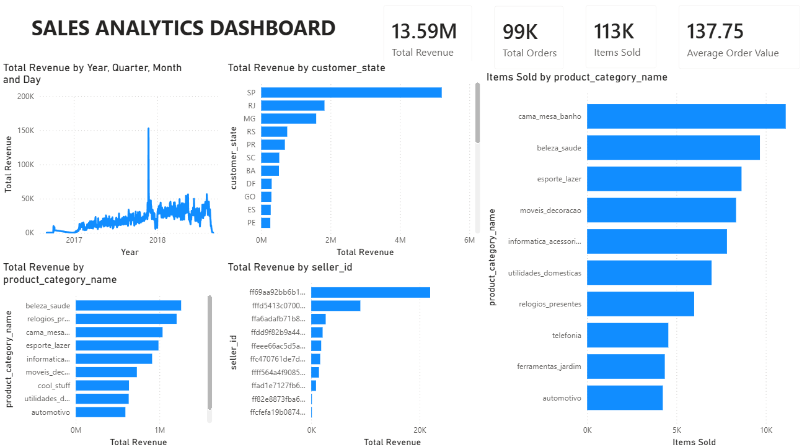

# Sales Analytics Dashboard: End-to-End E-Commerce Business Intelligence with SQL and Power BI

## Project Overview

This project is an end-to-end Business Intelligence portfolio project using the Olist Brazilian E-Commerce Public Dataset.

The goal is to simulate the workflow of a Junior Data Analyst: inspect raw data, design a relational model, write SQL analysis, build a Power BI dashboard, and communicate business findings clearly.

## Final Deliverables

This project delivers:

- PostgreSQL star schema design
- SQL-based data validation framework
- Business analysis queries
- Interactive Power BI dashboard
- Documentation and data modeling artifacts

The project simulates a complete Business Intelligence workflow from raw data ingestion to executive dashboard reporting.

## Project Outcome

The project successfully transformed raw e-commerce transaction data into a dimensional star schema, validated the data model using SQL, and delivered an interactive Power BI dashboard for sales analysis.

## Business Problem

An e-commerce marketplace needs a clearer view of sales performance across revenue, orders, customers, products, and regions.

- How is revenue changing over time?
- Which regions drive the most sales?
- Which product categories and products generate the most revenue?
- Which customers and sellers contribute most to order activity?
- Where are delivery delays or review-score problems likely to appear?

## Dataset

Olist Brazilian E-Commerce Public Dataset

Source:
https://www.kaggle.com/datasets/olistbr/brazilian-ecommerce

Raw data location:
`data/raw/`

Main tables:

| Table | Description |
|---|---|
| `customers` | Customer identifiers and location fields. |
| `orders` | Order status and lifecycle timestamps. |
| `order_items` | Item-level sales records with product, seller, price, and freight value. |
| `order_payments` | Payment method, installments, and payment value. |
| `order_reviews` | Review scores and optional review comments. |
| `products` | Product categories and product attributes. |
| `sellers` | Seller identifiers and location fields. |
| `geolocation` | ZIP-prefix geography reference data. |
| `product_category_translation` | Portuguese-to-English product category labels. |

## Tools Used

- PostgreSQL
- DBeaver
- Power BI
- Git / GitHub
- SQL
- Markdown Documentation

## Data Model

Fact Table

- fact_order_items

Dimensions

- dim_customer
- dim_product
- dim_seller
- dim_date

Grain

One row per order item.

## SQL Analysis

Key business analysis queries include:

- Revenue by Month
- Revenue by Product Category
- Revenue by Customer State
- Top Product Categories
- Top Sellers

The analysis layer demonstrates joins, aggregations, grouping, sorting, dimensional modeling, and business KPI reporting.

The project demonstrates:

- Joins
- Aggregations
- GROUP BY analysis
- Dimensional modeling
- Data validation
- Business KPI reporting

## Power BI Dashboard

Dashboard Pages:

## Dashboard Screenshots



### Executive Overview

KPIs:

- Total Revenue
- Total Orders
- Items Sold
- Average Order Value

Visuals:

- Revenue by Month
- Revenue by Product Category
- Revenue by Customer State
- Top Sellers
- Top Product Categories

Interactive Filters:

- Year
- Month
- Customer State
- Product Category

## Key Findings

- Revenue is concentrated in a small number of product categories.
- Sales performance varies significantly across Brazilian states.
- A limited number of sellers contribute a disproportionate share of revenue.
- Monthly revenue trends reveal seasonality and growth patterns.

## Limitations

- The dataset represents a single Brazilian e-commerce marketplace.
- Customer demographics are not available.
- Product-level profitability cannot be analyzed because cost data is unavailable.
- The project focuses on sales performance and does not include advanced forecasting or predictive analytics.

## Future Improvements

- Incorporate payment and review fact tables into the dimensional model.
- Add delivery performance and customer satisfaction reporting.
- Create additional dashboard pages for seller performance and operations.
- Implement trend forecasting and anomaly detection.
- Deploy the dashboard using the Power BI Service.

## Repository Structure

```text
sales-analytics-dashboard/
├── README.md
├── LICENSE
├── PROJECT_PLAN.md
├── data/
│   └── raw/
├── sql/
│   ├── schema/
│   ├── analysis/
│   └── validation/
├── powerbi/
│   ├── screenshots/
│   └── sales_analytics_dashboard.pbix
├── docs/
│   ├── project_plan.md
│   ├── dataset_inventory.md
│   ├── table_relationships.md
│   ├── data_quality_report.md
│   ├── star_schema_recommendation.md
│   ├── data_dictionary.md
│   ├── business_questions.md
│   ├── dashboard_specification.md
│   └── research_log.md
```

## Documentation

Additional project documentation can be found in the docs folder:

- Dataset Inventory
- Data Quality Report
- Data Dictionary
- Business Questions
- Dashboard Specification
- Research Log

## License

This project is licensed under the MIT License.
